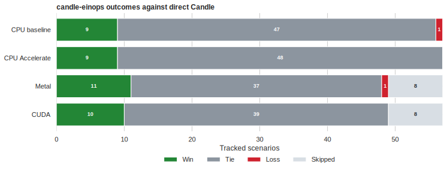
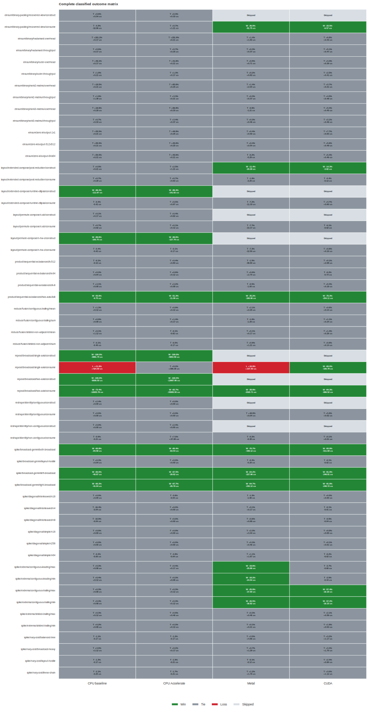

<!-- Generated by .github/scripts/generate_performance_report.py; do not edit by hand. -->
# Performance

This report freezes the optimized 2026-07-16 comparison of candle-einops against equivalent direct Candle 0.11 operations. It contains 39 wins, 171 ties, and 2 losses across 212 executed provider/scenario combinations.

Negative percentages and durations mean candle-einops is faster. `W`, `T`, and `L` mean classified win, statistical tie, and classified loss; `—` means the GPU construction-only scenario was skipped because a view enqueues no accelerator work.





## Snapshot

| Provider | Device | Wins | Ties | Losses | Skipped |
|---|---|---:|---:|---:|---:|
| CPU baseline | CPU (baseline) | 9 | 47 | 1 | 0 |
| CPU Accelerate | CPU (Accelerate) | 9 | 48 | 0 | 0 |
| Metal | Apple M4 Max | 11 | 37 | 1 | 8 |
| CUDA | NVIDIA GeForce RTX 4070 | 10 | 39 | 0 | 8 |

## Classified losses

- `repeat/broadcast/single-axis/consume` on CPU baseline: +11.6% and +424.00 us.
- `repeat/broadcast/single-axis/consume` on Metal: +16.9% and +107.50 us.

Both losses are the same deliberate repeat-view tradeoff. Direct Candle eagerly materializes `Tensor::repeat`; candle-einops returns a storage-sharing zero-stride view. Eager materialization is faster when this single leading repeat is immediately forced contiguous on baseline CPU or Metal, but it would discard the nearly allocation-free construction wins, the two-axis consumption wins, and the CUDA single-axis win. Callers that know they require an immediate contiguous result should benchmark direct `Tensor::repeat` for that path.

## Largest classified wins

- `repeat/broadcast/single-axis/construct` on CPU baseline: -100.0% and -3881.75 us.
- `repeat/broadcast/two-axis/construct` on CPU baseline: -100.0% and -9006.50 us.
- `repeat/broadcast/two-axis/construct` on CPU Accelerate: -100.0% and -13997.96 us.
- `repeat/broadcast/single-axis/construct` on CPU Accelerate: -100.0% and -4953.58 us.
- `layout/permute-compose/n-hw-c/construct` on CPU baseline: -99.6% and -105.75 us.
- `layout/permute-compose/n-hw-c/construct` on CPU Accelerate: -99.6% and -127.79 us.
- `layout/extended-compose/runtime-ellipsis/construct` on CPU baseline: -99.4% and -111.67 us.
- `layout/extended-compose/runtime-ellipsis/construct` on CPU Accelerate: -99.4% and -141.62 us.
- `spike/broadcast-gemm/both-broadcast` on CUDA: -93.9% and -511.69 us.
- `spike/broadcast-gemm/left-broadcast` on CUDA: -91.9% and -249.81 us.
- `spike/broadcast-gemm/right-broadcast` on CUDA: -91.8% and -248.72 us.
- `repeat/broadcast/two-axis/consume` on CUDA: -84.3% and -666.52 us.

## Complete scenario matrix

Each cell shows classification, median percentage delta, and median absolute delta.

| Scenario | CPU baseline | CPU Accelerate | Metal | CUDA |
|---|---:|---:|---:|---:|
| `einsum/binary-packing/recovered-view/construct` | T +0.6% / +0.54 us | T +0.3% / +0.33 us | — | — |
| `einsum/binary-packing/recovered-view/consume` | T -4.3% / -10.96 us | T +0.7% / +1.21 us | W -36.0% / -81.75 us | W -33.5% / -6.57 us |
| `einsum/binary/hadamard-overhead` | T +201.2% / +0.17 us | T +251.8% / +0.21 us | T +1.4% / +1.83 us | T +6.8% / +0.43 us |
| `einsum/binary/hadamard-throughput` | T +0.6% / +0.17 us | T +0.7% / +0.25 us | T +0.3% / +0.37 us | T +5.1% / +0.47 us |
| `einsum/binary/outer-overhead` | T +40.1% / +0.17 us | T +41.6% / +0.21 us | T +0.5% / +0.71 us | T +4.4% / +0.39 us |
| `einsum/binary/outer-throughput` | T +1.8% / +0.21 us | T +1.3% / +0.17 us | T +0.2% / +0.83 us | T +2.5% / +0.41 us |
| `einsum/binary/rank2-matmul-overhead` | T +18.5% / +0.21 us | T +85.6% / +0.25 us | T +1.4% / +2.04 us | T +3.7% / +0.31 us |
| `einsum/binary/rank2-matmul-throughput` | T +1.9% / +1.38 us | T +3.3% / +0.21 us | T +0.3% / +0.37 us | T +4.5% / +0.48 us |
| `einsum/binary/rank3-matmul-overhead` | T +18.9% / +0.29 us | T +66.8% / +0.33 us | T -0.9% / -1.21 us | T +5.4% / +0.45 us |
| `einsum/binary/rank3-matmul-throughput` | T +0.7% / +0.33 us | T +3.4% / +0.37 us | T +0.3% / +0.46 us | T +3.1% / +0.46 us |
| `einsum/zero-k/output-1x1` | T +55.5% / +0.21 us | T +49.9% / +0.25 us | T +0.4% / +0.50 us | T +7.7% / +0.63 us |
| `einsum/zero-k/output-512x512` | T +55.5% / +0.21 us | T +45.6% / +0.25 us | T +0.4% / +0.54 us | T +5.9% / +0.49 us |
| `einsum/zero-k/output-64x64` | T +55.5% / +0.21 us | T +45.6% / +0.21 us | T -0.2% / -0.29 us | T +5.4% / +0.46 us |
| `layout/extended-compose/post-reduction/construct` | T +0.5% / +0.21 us | T +2.5% / +1.21 us | W -11.4% / -20.29 us | W -14.3% / -3.82 us |
| `layout/extended-compose/post-reduction/consume` | T +0.7% / +0.29 us | T +0.7% / +0.63 us | T -1.9% / -3.25 us | T -0.4% / -0.12 us |
| `layout/extended-compose/runtime-ellipsis/construct` | W -99.4% / -111.67 us | W -99.4% / -141.62 us | — | — |
| `layout/extended-compose/runtime-ellipsis/consume` | T -0.4% / -0.42 us | T +0.5% / +0.67 us | T -7.2% / -11.33 us | T +4.7% / +0.60 us |
| `layout/permute-compose/c-ab/construct` | T +0.1% / +0.17 us | T +0.4% / +0.62 us | — | — |
| `layout/permute-compose/c-ab/consume` | T +0.7% / +0.92 us | T +0.1% / +0.12 us | T -7.7% / -13.17 us | T -0.1% / -0.02 us |
| `layout/permute-compose/n-hw-c/construct` | W -99.6% / -105.75 us | W -99.6% / -127.79 us | — | — |
| `layout/permute-compose/n-hw-c/consume` | T -0.4% / -0.42 us | T -0.1% / -0.17 us | T -7.3% / -12.50 us | T +0.8% / +0.10 us |
| `product/sequential-vs-balanced/k-512` | T -0.1% / -0.12 us | T +0.4% / +0.83 us | T -1.5% / -39.00 us | T +0.1% / +2.08 us |
| `product/sequential-vs-balanced/k-64` | T +0.2% / +0.04 us | T +0.6% / +0.12 us | T +0.6% / +2.75 us | T -0.2% / -0.73 us |
| `product/sequential-vs-balanced/k-8` | T +4.1% / +0.08 us | T +3.2% / +0.08 us | T -0.5% / -1.00 us | T +0.4% / +0.18 us |
| `product/sequential-vs-balanced/two-axis-8x8` | W -55.9% / -9.75 us | W -51.3% / -11.08 us | W -35.2% / -166.96 us | W -76.3% / -254.11 us |
| `reduce/fusion/contiguous-trailing/mean` | T +1.3% / +0.12 us | T +0.9% / +0.12 us | T +2.1% / +2.25 us | T +0.6% / +0.14 us |
| `reduce/fusion/contiguous-trailing/sum` | T +0.9% / +0.08 us | T +1.4% / +0.17 us | T -1.0% / -1.29 us | T +1.1% / +0.24 us |
| `reduce/fusion/strided-non-adjacent/mean` | T +0.1% / +1.12 us | T -0.1% / -0.62 us | T +0.1% / +0.17 us | T +1.4% / +0.26 us |
| `reduce/fusion/strided-non-adjacent/sum` | T -0.1% / -0.46 us | T -0.0% / -0.17 us | T +0.9% / +1.21 us | T +0.8% / +0.14 us |
| `repeat/broadcast/single-axis/construct` | W -100.0% / -3881.75 us | W -100.0% / -4953.58 us | — | — |
| `repeat/broadcast/single-axis/consume` | L +11.6% / +424.00 us | T +8.2% / +399.38 us | L +16.9% / +107.50 us | W -60.0% / -106.78 us |
| `repeat/broadcast/two-axis/construct` | W -100.0% / -9006.50 us | W -100.0% / -13997.96 us | — | — |
| `repeat/broadcast/two-axis/consume` | W -73.4% / -12625.79 us | W -83.7% / -33065.50 us | W -38.9% / -1520.71 us | W -84.3% / -666.52 us |
| `reshape/identity/contiguous/construct` | T +2.4% / +0.00 us | T +0.0% / +0.00 us | — | — |
| `reshape/identity/contiguous/consume` | T +0.0% / +0.00 us | T +0.0% / +0.00 us | T +48.8% / +0.04 us | T +5.9% / +0.02 us |
| `reshape/identity/non-contiguous/construct` | T +0.0% / +0.00 us | T +2.4% / +0.00 us | — | — |
| `reshape/identity/non-contiguous/consume` | T -0.0% / -0.21 us | T +7.0% / +37.08 us | T -0.2% / -0.38 us | T +0.1% / +0.01 us |
| `spike/broadcast-gemm/both-broadcast` | W -60.8% / -84.58 us | W -66.4% / -63.54 us | W -70.7% / -438.12 us | W -93.9% / -511.69 us |
| `spike/broadcast-gemm/layout-hostile` | T +0.3% / +0.04 us | T +0.0% / +0.00 us | T -0.3% / -0.29 us | T -0.1% / -0.02 us |
| `spike/broadcast-gemm/left-broadcast` | W -60.0% / -40.67 us | W -67.5% / -29.62 us | W -64.2% / -227.96 us | W -91.9% / -249.81 us |
| `spike/broadcast-gemm/right-broadcast` | W -60.3% / -41.04 us | W -67.7% / -29.79 us | W -64.7% / -230.12 us | W -91.8% / -248.72 us |
| `spike/diagonal/interleaved/n16` | T +0.0% / +0.00 us | T -3.6% / -0.04 us | T -1.3% / -1.96 us | T +0.0% / +0.00 us |
| `spike/diagonal/interleaved/n4` | T -16.4% / -0.04 us | T +0.0% / +0.00 us | T +0.1% / +0.17 us | T -0.1% / -0.01 us |
| `spike/diagonal/interleaved/n8` | T -10.9% / -0.04 us | T +0.0% / +0.00 us | T +0.6% / +0.88 us | T -0.5% / -0.04 us |
| `spike/diagonal/simple/n16` | T +0.0% / +0.00 us | T +0.0% / +0.00 us | T +2.3% / +3.33 us | T +0.0% / +0.00 us |
| `spike/diagonal/simple/n256` | T +0.0% / +0.00 us | T +0.0% / +0.00 us | T +0.3% / +0.46 us | T +0.1% / +0.01 us |
| `spike/diagonal/simple/n64` | T -0.3% / -0.00 us | T -4.9% / -0.04 us | T +1.1% / +1.67 us | T -0.2% / -0.02 us |
| `spike/extrema/contiguous-leading/max` | T +0.3% / +0.08 us | T +0.4% / +0.17 us | W -19.6% / -25.88 us | T -3.7% / -0.66 us |
| `spike/extrema/contiguous-leading/min` | T +0.4% / +0.12 us | T +0.2% / +0.08 us | W -18.2% / -24.54 us | T -2.5% / -0.44 us |
| `spike/extrema/contiguous-trailing/max` | T +0.3% / +0.08 us | T +0.3% / +0.12 us | W -25.9% / -37.00 us | W -57.4% / -16.18 us |
| `spike/extrema/contiguous-trailing/min` | T +0.3% / +0.08 us | T +0.3% / +0.12 us | W -26.5% / -36.62 us | W -57.2% / -16.15 us |
| `spike/extrema/strided-trailing/max` | T +0.3% / +0.12 us | T +0.9% / +0.46 us | T +0.3% / +0.46 us | T +2.1% / +0.59 us |
| `spike/extrema/strided-trailing/min` | T +0.2% / +0.08 us | T +0.2% / +0.12 us | T +0.1% / +0.21 us | T +1.9% / +0.53 us |
| `spike/nary-cost/balanced-tree` | T -1.1% / -0.17 us | T -1.2% / -0.17 us | T +3.5% / +4.96 us | T +3.2% / +1.17 us |
| `spike/nary-cost/broadcast-heavy` | T +4.0% / +2.12 us | T +0.2% / +0.17 us | T +0.7% / +1.29 us | T +3.3% / +1.70 us |
| `spike/nary-cost/layout-hostile` | T -1.3% / -0.17 us | T -1.5% / -0.21 us | T -0.1% / -0.12 us | T +2.4% / +0.90 us |
| `spike/nary-cost/linear-chain` | T -2.1% / -0.25 us | T -1.7% / -0.21 us | T +1.2% / +1.79 us | T +3.0% / +1.12 us |

## Methodology

Every executed cell uses an optimized release build, 5 independent processes, and 25 timed samples per process after warmup and device synchronization. A classified loss must exceed 10% and 1 us, with its 95% confidence interval excluding 5%. The same rules classify wins in the negative direction. Results inside those materiality and confidence boundaries are ties, even when a tiny operation has a large percentage delta.

The benchmark compares complete public candle-einops paths with equivalent handwired Candle operations. It does not claim custom kernels: wins come from avoiding copies, reshapes, dispatches, or unfavorable operation ordering before invoking Candle's existing kernels.

## Data and reproduction

The normalized source data is committed at [`benchmarks/data/performance-2026-07-16.json`](../benchmarks/data/performance-2026-07-16.json). It includes provider metadata, process medians, confidence intervals, workload metadata, and classification thresholds.

Regenerate the report and figures from committed data:

```console
uv run --project benchmarks/reporting python .github/scripts/generate_performance_report.py
uv run --project benchmarks/reporting python .github/scripts/generate_performance_report.py --check
```

Refresh the normalized snapshot after collecting four new `gaps` summaries:

```console
uv run --project benchmarks/reporting python .github/scripts/generate_performance_report.py --import-summaries \
  target/benchmarks/final-complete-2/cpu-baseline/summary.json \
  target/benchmarks/final-complete-2/cpu-accelerate/summary.json \
  target/benchmarks/final-complete/metal/summary.json \
  target/benchmarks/final-complete-2/cuda/summary.json
```

Machine and driver metadata should always be reviewed before comparing snapshots across hosts.
